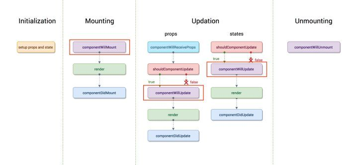

### 组件生命周期的三个阶段

1. Mounting（加载阶段）
2. Updating（更新阶段）
3. Unmounting（卸载阶段）

### 旧的生命周期


#### Mounting（加载阶段：涉及6个钩子函数）

**constructor()**

```
加载的时候调用一次，可以初始化state
```

**getDefaultProps()**


```
设置默认的props，也可以用dufaultProps设置组件的默认属性。
```

**getInitialState()**

```
初始化state，可以直接在constructor中定义this.state
```

**componentWillMount()**

```
组件加载时只调用，以后组件更新不调用，整个生命周期只调用一次，此时可以修改state
```

**render()**

```
react最重要的步骤，创建虚拟dom，进行diff算法，更新dom树都在此进行
```

**componentDidMount()**

```
组件渲染之后调用，只调用一次
```

#### Updating（更新阶段：涉及5个钩子函数)

**componentWillReceivePorps(nextProps)**

```
组件加载时不调用，组件接受新的props时调用
```

**shouldComponentUpdate(nextProps, nextState)**

```
组件接收到新的props或者state时调用，return true就会更新dom（使用diff算法更新），return false能阻止更新（不调用render）
```

**componentWillUpdata(nextProps, nextState)**

```
组件加载时不调用，只有在组件将要更新时才调用，此时可以修改state
```

**render()**

```
react最重要的步骤，创建虚拟dom，进行diff算法，更新dom树都在此进行
```

**componentDidUpdate()**

```
组件加载时不调用，组件更新完成后调用
```

#### Unmounting（卸载阶段：涉及1个钩子函数）

**componentWillUnmount()**

```
组件渲染之后调用，只调用一次
```

#### 组件的基本写法

```
import React, { Component } from 'react'

export default class OldReactComponent extends Component {
    constructor(props) {
        super(props)
        // getDefaultProps：接收初始props
        // getInitialState：初始化state
    }
    state = {

    }
    componentWillMount() { // 组件挂载前触发

    }
    render() {
        return (
            <h2>Old React.Component</h2>
        )
    }
    componentDidMount() { // 组件挂载后触发

    }
    componentWillReceivePorps(nextProps) { // 接收到新的props时触发

    }
    shouldComponentUpdate(nextProps, nextState) { // 组件Props或者state改变时触发，true：更新，false：不更新
        return true
    }
    componentWillUpdate(nextProps, nextState) { // 组件更新前触发

    }
    componentDidUpdate() { // 组件更新后触发

    }
    componentWillUnmount() { // 组件卸载时触发

    }
}
```

### 新的生命周期

#### Mounting（加载阶段：涉及4个钩子函数）

**constructor()**

```
加载的时候调用一次，可以初始化state
```

**static getDerivedStateFromProps(props, state)**

```
组件每次被rerender的时候，包括在组件构建之后(虚拟dom之后，实际dom挂载之前)，每次获取新的props或state之后；每次接收新的props之后都会返回一个对象作为新的state，返回null则说明不需要更新state；配合componentDidUpdate，可以覆盖componentWillReceiveProps的所有用法
```

**render()**

```
react最重要的步骤，创建虚拟dom，进行diff算法，更新dom树都在此进行
```

**componentDidMount()**

```
组件渲染之后调用，只调用一次
```

#### Updating（更新阶段：涉及5个钩子函数)

**static getDerivedStateFromProps(props, state)**

```
组件每次被rerender的时候，包括在组件构建之后(虚拟dom之后，实际dom挂载之前)，每次获取新的props或state之后；每次接收新的props之后都会返回一个对象作为新的state，返回null则说明不需要更新state；配合componentDidUpdate，可以覆盖componentWillReceiveProps的所有用法
```

**shouldComponentUpdate(nextProps, nextState)**

```
组件接收到新的props或者state时调用，return true就会更新dom（使用diff算法更新），return false能阻止更新（不调用render）
```

**render()**

```
react最重要的步骤，创建虚拟dom，进行diff算法，更新dom树都在此进行
```

**getSnapshotBeforeUpdate(prevProps, prevState)**

```
触发时间: update发生的时候，在render之后，在组件dom渲染之前；返回一个值，作为componentDidUpdate的第三个参数；配合componentDidUpdate, 可以覆盖componentWillUpdate的所有用法
```

**componentDidUpdate()**

```
组件加载时不调用，组件更新完成后调用
```

#### Unmounting（卸载阶段：涉及1个钩子函数）

```
组件渲染之后调用，只调用一次
```

#### Error Handling(错误处理)

**componentDidCatch(error，info)**

```
任何一处的javascript报错会触发
```

#### 组件的基本写法

```
import React, { Component } from 'react'

export default class NewReactComponent extends Component {
    constructor(props) {
        super(props)
        // getDefaultProps：接收初始props
        // getInitialState：初始化state
    }
    state = {

    }
    static getDerivedStateFromProps(props, state) { // 组件每次被rerender的时候，包括在组件构建之后(虚拟dom之后，实际dom挂载之前)，每次获取新的props或state之后；;每次接收新的props之后都会返回一个对象作为新的state，返回null则说明不需要更新state
        return state
    }
    componentDidCatch(error, info) { // 获取到javascript错误

    }
    render() {
        return (
            <h2>New React.Component</h2>
        )
    }
    componentDidMount() { // 挂载后
        
    }   
    shouldComponentUpdate(nextProps, nextState) { // 组件Props或者state改变时触发，true：更新，false：不更新
        return true
    }
    getSnapshotBeforeUpdate(prevProps, prevState) { // 组件更新前触发

    }
    componentDidUpdate() { // 组件更新后触发

    }
    componentWillUnmount() { // 组件卸载时触发

    }
}
```

### 总结

旧的生命周期



新的生命周期


1. React16新的生命周期弃用了componentWillMount、componentWillReceivePorps，componentWillUpdate
2. 新增了getDerivedStateFromProps、getSnapshotBeforeUpdate来代替弃用的三个钩子函数（componentWillMount、componentWillReceivePorps，componentWillUpdate）
3. React16并没有删除这三个钩子函数，但是不能和新增的钩子函数（getDerivedStateFromProps、getSnapshotBeforeUpdate）混用，React17将会删除componentWillMount、componentWillReceivePorps，componentWillUpdate
4. 新增了对错误的处理（componentDidCatch）