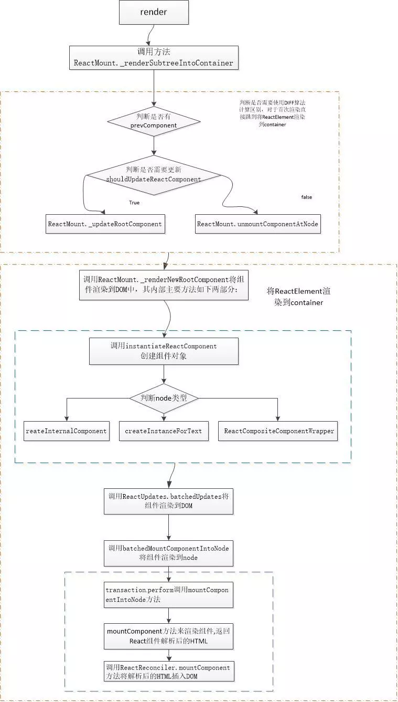

在介绍React渲染机制之间先来说一说下面几个概念，对于新入手React的学员来说，经常会被搞蒙圈。
       **React与ReactDOM区别**
       在v0.14前,ReactDOM是React的函数，之所以在v0.14之后分成两个包是package是因为

> ​      As we look at packages like react-native, react-art, react-canvas, and react-three, it has become clear that the beauty and essence of React has nothing to do with browsers or the DOM.
> ​       To make this more clear and to make it easier to build more environments that React can render to, we’re splitting the main react package into two: react and react-dom. This paves the way to writing components that can be shared between the web version of React and React Native. We don’t expect all the code in an app to be shared, but we want to be able to share the components that do behave the same across platforms.

​      可见，React分为react-dom和react的原因是React-Native的出现，它可以实现跨平台实现相同的组件。
​       react包包含了React.createElement、 .createClass、 .Component、 .PropTypes、.Children以及其他的描述元素和组件的类。
​       react-dom包包含了ReactDOM.render、.unmountComponentAtNode和.findDOMNode等。下面看一个创建组件的实例：

```javascript
var React = require('react');
var ReactDOM = require('react-dom');
var MyComponent = React.createClass({
render: function() {
return <div>Hello World</div>;
}
});
ReactDOM.render(<MyComponent />, node);
```

​      ReactDOM.render是React的最基本方法用于将模板转为HTML语言，并插入指定的DOM节点。它可以将一个React元素呈现在指定的DOM container中，并返回对组件的引用对象。

​      **Component、Element和Component**

​       **Component**
​       Component组件就是JavaScript函数，可以接受任意参数。可以使用createClass和Component创建组件。createClass如其名就是创建React组件对应的类，描述你将要创建组件的各种行为，其中只有当组件被渲染时需要输出的内容的render接口是必须实现的，其他都是可选：

```javascript
var SayHello = React.createClass({
      render: function() {
      return <div>Hello {this.props.name}</div>;
    }
});
```

从 React 0.13 开始，可以使用 ES6 Class代替 React.createClass了

```javascript
class SayHello extends React.Component {
render() {
return <div>Hello {this.props.name}</a> </div>;
}
}
```

注意：（1）为了区分Component和DOM 元素，所有Component名字要首字母大写。
       （2）所有的React组件都不能修改它的prop属性的值
        **Element**
       Element是class的一个实例，它描述DOM节点或component实例的字面级对象。它包含一些信息，包括组件类型type和属性props。就像一个描述DOM节点的元素(虚拟节点)。可以使用createElement，创建React组件实例

```javascript
ReactElement.createElement= function(type, config, children) {
...
}
```

在上一篇文章中我们已经讲到，当我们用JSX来描述< SayHello />时 ，编译后就是React.createElement()。
       **Factory**
       React.createFactory和ReactElement.createElement一样，但是
 Factory返回的是给定元素类型或组件类的实例。React.createFactory的定义基本就是如下形式，Element 的类型被提前绑定了

```javascript
ReactElement.createFactory = function (type) {
var factory = ReactElement.createElement.bind(null, type);
    factory.type = type;
    return factory;
};
```

官方鼓励使用JSX或者React.creatElement。下面进入今天的主题：React的渲染机制
       **React渲染机制**
       假设要实现的渲染代码如下：

```javascript
  class Form extends React.Component {
    constructor() {
    super();
  }
  render() {
    return (
        <form>
          <input type="text"/>
        </form>
    );
  }
}

ReactDOM.render( (
  <div className="test">
    <p>请输入你的信息</p>
    <Form/>
  </div>
), document.getElementById('example'))
```

​      从ReactDOM入口开始，找到ReactDOM.js文件

```javascript
var ReactDOMComponentTree = require('./ReactDOMComponentTree');
var ReactDefaultInjection = require('./ReactDefaultInjection');
var ReactMount = require('./ReactMount');
var ReactReconciler = require('./ReactReconciler');
var ReactUpdates = require('./ReactUpdates');
var ReactVersion = require('./ReactVersion');

var findDOMNode = require('./findDOMNode');
var getHostComponentFromComposite = require('./getHostComponentFromComposite');
var renderSubtreeIntoContainer = require('./renderSubtreeIntoContainer');
var warning = require('fbjs/lib/warning');
ReactDefaultInjection.inject(); 
var ReactDOM = {
  findDOMNode: findDOMNode,
  render: ReactMount.render,
  unmountComponentAtNode: ReactMount.unmountComponentAtNode,
  version: ReactVersion,

  /* eslint-disable camelcase */
  unstable_batchedUpdates: ReactUpdates.batchedUpdates,
  unstable_renderSubtreeIntoContainer: renderSubtreeIntoContainer
  /* eslint-enable camelcase */
};
```

​      ReactDOM.render()方法来自ReactMount文件的render方法：

```javascript
render: function (nextElement, container, callback) {
    return ReactMount._renderSubtreeIntoContainer(null, nextElement, container, callback);
  },
```

​       Render方法返回的是当前文件下的_renderSubtreeIntoContainer方法，顾名思义，它的作用是将子树nextElement注入到指定的container中，并调用其回调方法_renderSubtreeIntoContainer方法主要完成以下一个功能：

1. 调用React.createElement生成待插入节点的虚拟DOM的实例对象（上篇文章中已经讲到，这里就不再重复叙述）
2. 与之前的component比较，如果是初次渲染直接将虚拟DOM转换为真实DOM
3. 将真实的组件写到对应的container节点中

```javascript
_renderSubtreeIntoContainer: function (parentComponent, nextElement, container, callback) {
/*
*将callback放入到React的更新队列中，判断nextElement有效性以及当前是发开环境还是生产环境。（代码省略）
*/
…

var nextWrappedElement = React.createElement(TopLevelWrapper, {child: nextElement});
// 返回一个ReactElement实例对象，也就是虚拟DOM的实例对象，下面就要把它渲染出来
var nextContext;
/*（1）判断是否有parentComponent，如果有则将其写到parentComponent*/
if (parentComponent) {
var parentInst = ReactInstanceMap.get(parentComponent);
nextContext = parentInst._processChildContext(parentInst._context);
} else {
nextContext = emptyObject;
}

var prevComponent =getTopLevelWrapperInContainer(container);
 /*
*（2）判断是否有prevComponent，如果有则取其child，利用Diff算法判断是否需要更新，如果需要则调用_updateRootComponen 方法，并return结果。对于初次渲染不需要该过程。 
*/

if (prevComponent) {
var prevWrappedElement = prevComponent._currentElement;
var prevElement = prevWrappedElement.props.child;
 // shouldUpdateReactComponent方法判断是否需要更新,对同一DOM进行比较，type相同，key(如果有)相同的组件做DOM diff 

if (shouldUpdateReactComponent(prevElement, nextElement)) {
var publicInst = prevComponent._renderedComponent.getPublicInstance();
var updatedCallback = callback && function () {
callback.call(publicInst);
};
ReactMount._updateRootComponent(prevComponent, nextWrappedElement, nextContext, container, updatedCallback);
return publicInst;
} else {
ReactMount.unmountComponentAtNode(container);
}
}
/*
*（3）对于prevElement为null直接跳到此步
var reactRootElement = getReactRootElementInContainer(container);
var containerHasReactMarkup = reactRootElement && !!internalGetID(reactRootElement);
var containerHasNonRootReactChild = hasNonRootReactChild(container);
var shouldReuseMarkup = containerHasReactMarkup && !prevComponent && !containerHasNonRootReactChild;
/*
*3核心部分，调用_renderNewRootComponent，_renderedComponent，getPublicInstance三个方法，
*/
var component =ReactMount._renderNewRootComponent(nextWrappedElement, container, shouldReuseMarkup, nextContext)._renderedComponent.getPublicInstance();
if (callback) {
callback.call(component);
}
return component;
}
```

下面来看一看ＲenderNewRootComponent方法的源码

**（1）_renderNewRootComponent：**

```javascript
_renderNewRootComponent: function (nextElement, container, shouldReuseMarkup, context) {
… …
 /*
*第一部分是调用instantiateReactComponen方法返回虚拟DOM对应的DOM，并将其返回结果作为_renderNewRootComponent的最终返回结果 
*/
var componentInstance = <a name="OLE_LINK14"></a> <a name="OLE_LINK13">instantiateReactComponent</a> (nextElement, false);
return componentInstance;
 /*
*第二部分是处理batchedMountComponentIntoNode方法，并将上面的结果componentInstance 结果插入到DOM中
*/*

ReactUpdates.batchedUpdates(batchedMountComponentIntoNode, componentInstance, container, shouldReuseMarkup, context);
var wrapperID = componentInstance._instance.rootID;
instancesByReactRootID[wrapperID] = componentInstance;
return componentInstance;
}
```

**解析第一部分：将虚拟DOM生成DOM**
        再来看一看instantiateReactComponent方法，它是从instantiateReactComponent文件require进来的，输入参数是虚拟DOM节点，主要实现的功能是将虚拟DOM生成DOM。根element的类型不同，分别实例化ReactDOMTextComponent, ReactDOMComponent, ReactCompositeComponent类。
 下面来看一看instantiateReactComponent.js源码的伪代码

```javascript
function instantiateReactComponent(node, shouldHaveDebugID) {
var instance;
/*
*判断node类型，不同的类型调用不同的渲染方法
*/
/*节点为空*/
instance = ReactEmptyComponent.create(instantiateReactComponent); 
/*如果节点是宿主内置节点，譬如浏览器的 的节点*/
instance = ReactHostComponent.createInternalComponent(element);

instance = new ReactCompositeComponentWrapper(element);
/*如果节点是字符串或数字*/
instance = ReactHostComponent.createInstanceForText(node);
return instance;
}
```

**解析第二部分：将新的component分批插入到DOM中**
        batchedUpdates是ReactUpdates的一个方法，使用batchingStrategy更新DOM

```javascript
function batchedUpdates(callback, a, b, c, d, e) {
ensureInjected();
return batchingStrategy .batchedUpdates(callback, a, b, c, d, e);
}
```

​       **batchedUpdates**  方法的回调函数是batchedMountComponentIntoNode方法

```javascript
function batchedMountComponentIntoNode(componentInstance, container, shouldReuseMarkup, context) {
var transaction = ReactUpdates.ReactReconcileTransaction.getPooled(
/* useCreateElement */
!shouldReuseMarkup && ReactDOMFeatureFlags.useCreateElement);
transaction.perform(mountComponentIntoNode, null, componentInstance, container, transaction, shouldReuseMarkup, context);
ReactUpdates.ReactReconcileTransaction.release(transaction);
}
```

**batchedMountComponentIntoNode**  方法通过
 transaction.perform调用mountComponentIntoNode方法。

```javascript
/*
* Mounts this component and inserts it into the DOM.
* @param {ReactComponent} componentInstance The instance to mount.
* @param {DOMElement} container DOM element to mount into.
* @param {ReactReconcileTransaction} transaction
* @param {boolean} shouldReuseMarkup If true, do not insert markup
*/
function mountComponentIntoNode(wrapperInstance, container, transaction, shouldReuseMarkup, context) {
var markerName;
if (ReactFeatureFlags.logTopLevelRenders) {
var wrappedElement = wrapperInstance._currentElement.props.child;
var type = wrappedElement.type;
markerName = 'React mount: ' + (typeof type === 'string' ? type : type.displayName || type.name);
console.time(markerName);
}
 **//*调用对应ReactReconciler中的mountComponent方法来渲染组件,返回React组件解析后的HTML** 

var markup = ReactReconciler.mountComponent(wrapperInstance, transaction, null, ReactDOMContainerInfo(wrapperInstance, container), context, 0 /* parentDebugID */);
if (markerName) {
console.timeEnd(markerName);
}
wrapperInstance._renderedComponent._topLevelWrapper = wrapperInstance;
 /*将解析出来的HTML插入DOM中 ReactMount._mountImageIntoNode</a> (markup, container, wrapperInstance, shouldReuseMarkup, transaction);

}
```

**_mountImageIntoNode** 可以实现将HTML插入DOM中的操作方法是：

```javascript
_mountImageIntoNode: function (markup, container, instance, shouldReuseMarkup, transaction) {
/*是否复用markup
if (shouldReuseMarkup) {
/*如果可以复用，直接将instance插入到根元素** 
var rootElement = getReactRootElementInContainer(container);
if (ReactMarkupChecksum.canReuseMarkup(markup, rootElement)) {
ReactDOMComponentTree.precacheNode(instance, rootElement);
return;
} else {
/*创建新的normalizedMarkup
var checksum = rootElement.getAttribute(ReactMarkupChecksum.CHECKSUM_ATTR_NAME);
rootElement.removeAttribute(ReactMarkupChecksum.CHECKSUM_ATTR_NAME);
var rootMarkup = rootElement.outerHTML;
rootElement.setAttribute(ReactMarkupChecksum.CHECKSUM_ATTR_NAME, checksum);
var normalizedMarkup = markup;
if (process.env.NODE_ENV !== 'production') {
var normalizer;
if (container.nodeType === ELEMENT_NODE_TYPE) {
normalizer = document.createElement('div');
normalizer.innerHTML = markup;
normalizedMarkup = normalizer.innerHTML;
} else {
normalizer = document.createElement('iframe');
document.body.appendChild(normalizer);
normalizer.contentDocument.write(markup);
normalizedMarkup = normalizer.contentDocument.documentElement.outerHTML;
document.body.removeChild(normalizer);
}
}
if (transaction.
while (container.lastChild) {
container.removeChild(container.lastChild);
}
DOMLazyTree.insertTreeBefore(container, markup, null);
} else {
/*利用innerHTML将markup插入到container这个DOM元素上** 
setInnerHTML(container, markup);
 /*将instance保存到container的原生节点firstChild上*/
ReactDOMComponentTree.precacheNode(instance, container.firstChild);
}
if (process.env.NODE_ENV !== 'production') {
var hostNode = ReactDOMComponentTree.getInstanceFromNode(container.firstChild);
if (hostNode._debugID !== 0) {
ReactInstrumentation.debugTool.onHostOperation({
instanceID: hostNode._debugID,
type: 'mount',
payload: markup.toString()
});
}
}
}
};
```

这么多的内容有点懵懵的，下面我们通过简单的流程图总结：

