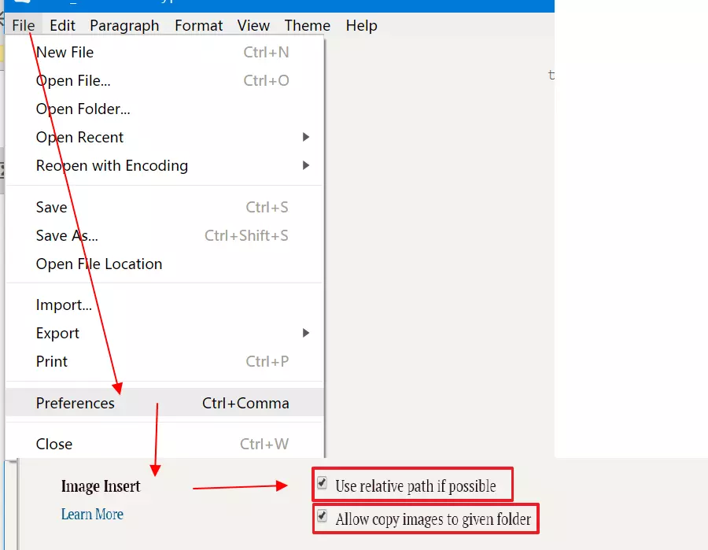
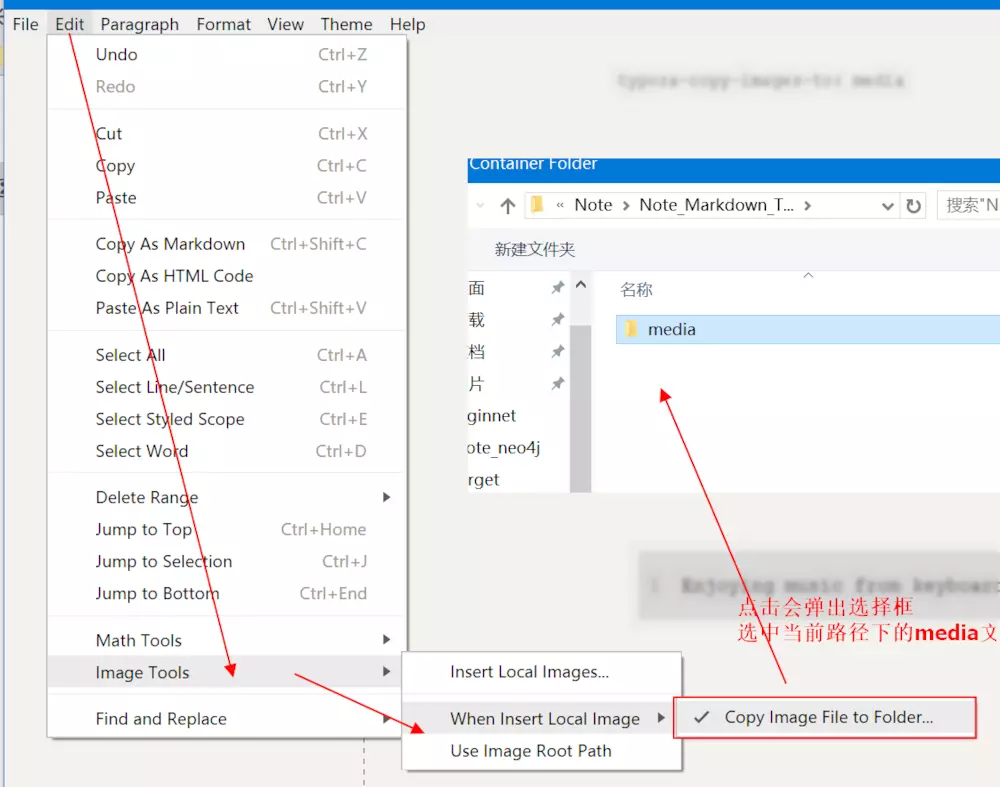
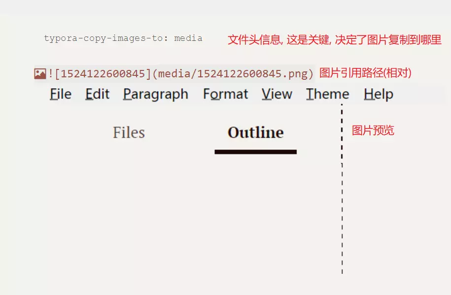
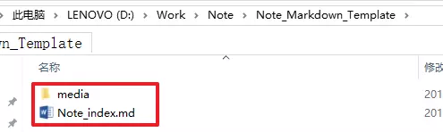

> `Typora`一款小巧, 清新, 简洁易用的`Markdown`文件编辑器. 个人较为喜欢. 但是之前一直有个"缺陷"让我不满意. 即插入图片不是很方便: 粘贴粘贴板里的图片, 会在当前光标下生成图片引用路径(赞), but, 只是图片的绝对路径, 这意味着, 当你想将辛苦书写的Markdown文件和别人分享交流时, 图片就是很大问题, 所以这样操作根本就没有用处.

## Typora是什么?

> Typora — a markdown editor, markdown reader.
> 官网暂时打不开, 找到别人介绍她的文章链接, 可以大概了解下.

[安利一下Typora：极致简洁的markdown编辑器](https://www.jianshu.com/p/5256ecc06eec)

## 新发现了什么功能?

读过上文, 就知道, 这款软件让我最大不满意的地方就是, 图片引用的问题.
今天以为get到了她的新功能. 听我慢慢道来.

**通过配置可以使得, 粘贴图片至光标处时, 做了两件伟大的事情:**

1. 将复制的图片copy一份至md文档当前路径下的`media`文件夹里;
2. 光标出自动生成图片的引用路径, 且是相对路径, 如`./media/xxx.png`

### 配置

1. 打开`复制图片`功能



1. md文件下建立`media`文件夹, 并指定它为复制图片的存储路径

   

   

### 效果



按下

```
ctrl+/
```

可进入

源码模式

查看:

  

## 后话

### 以后如何方便的使用这个功能?

**注意: 单个md文件的配置只是针对它自己有效**, 重新新建的文件, 复制图片的路径配置失效.
 所以为了方便, 有两种思路:

1. 提前准备md文件模板:

```
| root
    | Note_index.md
    | media/
```

配置好模板md图片复制的路径为media.



1. 记住头文件配置:

```
---
typora-copy-images-to: media
---
```

### 为什么用`media`文件夹?

这是因为笔者想和另一款word+Markdown插件`Writage`无缝对接.
 该插件使得word能够编辑md文件, 复制粘贴图片会在当前md文件的media路径下保存此图片.
 即实现使用word(带Writage插件)编辑和使用Typora编辑效果一样.