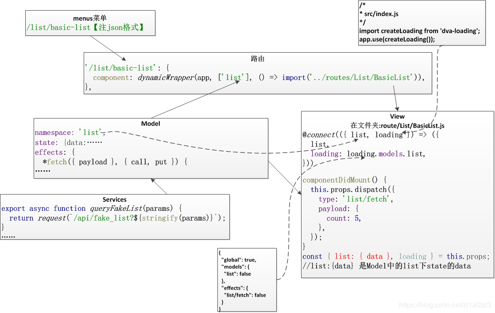

## 一、概述

------

　　以列表页中的标准列表为主

　　

　　Ant Design Pro 默认通过只需浏览器单方面就可处理的 HashHistory 来完成路由。如果要切换为 BrowserHistory，那在 src/index.js 中也有对应的内容可以直接修改，但需要在后端服务器进行相应路由配置。

## 二、详述

------

加载过程图



 

## 2.1、菜单→路由→组件

　　在左侧的导航栏点击 `列表页 > 标准列表` 后，可以进入到上面截图所示的页面。导航栏的内容在 `src/common/menu.js` 中【或者服务获取的地址】

### 菜单：

```javascript
{
        name: '列表页',
        icon: 'table',
        path: 'list',
        children: [
          {
            name: '查询表格',
            path: 'table-list',
          },
          {
            name: '标准列表',
            path: 'basic-list',
          },
         //……   
        ],
      },
```

### 路由

　　全局的路由关系是：`src/index.js` 中通过 `app.router(require('./router').default);`，将 `src/router.js` 绑定到 `dva` 实例的 `router` 方法上。而在 `src/router.js` 中又引入了 `src/common/router.js` 中的 `getRouterData` 作为数据源。

　　其实就是相当于：`src/common/menu.js` 中 `path` 所指向的路径对应于 `src/common/router.js` 中的路由记录。

```javascript
export const getRouterData = (app) => {
  const routerConfig = {
    ...,
    '/list/basic-list': {
      component: dynamicWrapper(app, ['list'], () => import('../routes/List/BasicList')),
    },
    ...,
  };
  ...
}
```

　　这里调用了同文件内的 lazy-loading 的动态加载函数 `dynamicWrapper`，有 3 个参数，`app` 为全局 `dva` 实例，`models` 为一个带有相关 `dva` Model 的 Array，`component` 即为该路由记录对应的实际组件。 

```javascript
const dynamicWrapper = (app, models, component) => {...};
```

　   可以看到：

　　　　1、加载路由的时候,会动态加载当前文件下的model文件,也就是对应文件下的src/models/list.js

### 组件：

　　`src/routes/List/BasicList.js`，具体组件。已省略部分代码

```javascript
import React, { PureComponent } from 'react';
import { connect } from 'dva';
//……

import PageHeaderLayout from '../../layouts/PageHeaderLayout';
@connect(({ list, loading }) => ({
  list,
  loading: loading.models.list,
}))
export default class BasicList extends PureComponent {
  componentDidMount() {
    this.props.dispatch({
      type: 'list/fetch',
      payload: {
        count: 5,
      },
    });
  }
  render() {
    return (
      <PageHeaderLayout>{/* 页面内容…… */}</PageHeaderLayout>
    );
  }
}
```

## 2.2、@connect 装饰器

　　组件写法中调用了 `dva` 所封装的 `react-redux` 的 `@connect` 装饰器，用来接收绑定的 `list` 这个 model 对应的 redux store。注意到这里的装饰器实际除了 `app.state.list` 以外还实际接收 `app.state.loading` 作为参数，这个 `loading` 的来源是 `src/index.js` 中调用的 `dva-loading`这个插件。

```javascript
/*
* src/index.js
*/
import createLoading from 'dva-loading';
app.use(createLoading());
```

它返回的信息包含了 global、model 和 effect 的异步加载完成情况。

数据map一

```javascript
{
  "global": true,
  "models": {
    "list": false,
    "user": true,
    "rule": false
  },
  "effects": {
    "list/fetch": false,
    "user/fetchCurrent": true,
    "rule/fetch": false
  }
}
```

注意到在这里带上 `{count: 5}` 这个 payload 向 store 进行了一个类型为 `list/fetch` 的 dispatch，在 `src/models/list.js` 中就可以找到具体的对应操作。 

```javascript
import { queryFakeList } from '../services/api';
export default {
  namespace: 'list',
  state: {
    list: [],
  },
  effects: {
    *fetch({ payload }, { call, put }) {
      const response = yield call(queryFakeList, payload);
      yield put({
        type: 'queryList',
        payload: Array.isArray(response) ? response : [],
      });
    },
    /* ... */
  },
  reducers: {
    queryList(state, action) {
      return {
        ...state,
        list: action.payload,
      };
    },
    /* ... */
  },
};
```

View中使用

1、connect使用

```javascript
@connect(({ list, loading }) => ({
  list,//①
  loading: loading.models.list,//②
}))
```

　　说明：

**1、connect 有两个参数,mapStateToProps以及mapDispatchToProps,一个将状态绑定到组件的props一个将方法绑定到组件的props**

**2、代码①：将实体list中的state数据绑定到props，注意绑定的是实体list整体，使用时需要list.[state中的具体变量]**

**3、代码②：通过loading将上文“数据map一”中的models的list的key对应的value读取出来。赋值给loading，以方便使用，如表格是否有加载图标**

　**当然代码②也可以通过key value编写：loading.effects["list/fetch"]**

2、变量获取

因，在`src/models/list.js`

```javascript
export default {
  namespace: 'list',
  state: {
    list: [],
  },
```

故在view中使用

```javascript
  render() {
    const { list: { list }, loading } = this.props;
```

说明：

　　定义使用时：list: { list }  ，含义实体list下的state类型的list变量