```css
看这个定义弹性布局盒子
	display:-webkit-box;
    display: -moz-box;
    display: -ms-flexbox;
    display: -webkit-flex;
    display: flex;
定义子元素排列
	-webkit-box-orient:vertical;
    -webkit-box-direction:normal;
    -moz-box-orient:vertical;
    -moz-box-direction:normal;
    flex-direction:column;
    -webkit-flex-direction:column;
定义子元素换行情况
	-webkit-flex-wrap:wrap;
    -webkit-box-lines:multiple;
    -moz-flex-wrap:wrap;
    flex-wrap:wrap; 
	-webkit-flex-flow:row wrap;
    -webkit-box-orient:horizontal;
    -webkit-box-lines:multiple;　　
	-moz-flex-flow:row wrap;
    box-orient:horizontal;
    box-lines:multiple;
    flex-flow:row wrap;
横向排列布局
    -webkit-justify-content:center;
    justify-content:center;
    -moz-box-pack:center;
    -webkit--moz-box-pack:center;
    box-pack:center;
竖向排列布局
    align-items:center;
    -webkit-align-items:center;
    box-align:center;
    -moz-box-align:center;
    -webkit-box-align:center;
伸缩盒子布局兼容
    box-flex:num;
    -webkit-box-flex:num;
    -moz-box-flex:num;
    flex:num;
    -webkit-flex:num;
元素出现顺序
    box-order:num;
    -webkit-box-order:num;
    -moz-box-order:num;
    order:num;
    -webkit-order:num;
```

# [弹性布局各种坑爹兼容](http://www.cnblogs.com/yangjie-space/p/4856109.html)

 

当然也看到过遇到flexbox布局的属性将所有的新的老的前缀都加上的，这样省事啊 谁闲着没事整天研究那几个属性的兼容，更可况前端发展这么快说不定有更牛逼的样式出现

但是想在移动端用好这个布局摸透这个属性 我还是一个个都探究下吧，在此先说下各浏览器PC端最新版本情况目前：IE最新版本是ie11， FF最新版本是ff41.0， Chrome最新版本是chrome45.0， Safira最新版本8.0.3， opera最新版本是31 然而这些最新版本对我们来说并没什么卵用 只是个标准 没有谁电脑装的都是最新版浏览器，好吧 看下各个属性兼容

**display:box/flexbox/flex** 先看这个定义弹性布局盒子 附上兼容图

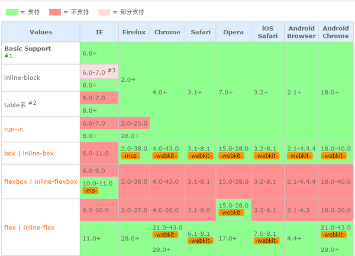

还是比较直观对此属性做兼容只需如下

```
    display:-webkit-box;
    display: -moz-box;
    display: -ms-flexbox;
    display: -webkit-flex;
    display: flex;
```

**定义子元素排列**

目前有两种新的写法flex-direction和旧的写法box-orient+box-direction，

新写法flex-direction的兼容

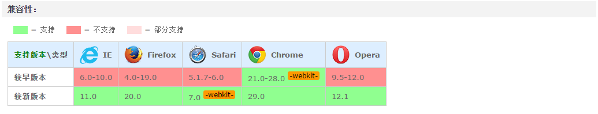

旧写法box-orient和box-direction兼容一样的

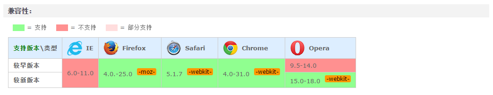

可以看出，ie11下版本还是不支持方向这属性，其他浏览器要加前缀，所以当要定义方向时这个兼容可以写成

```
    -webkit-box-orient:vertical;
    -webkit-box-direction:normal;
    -moz-box-orient:vertical;
    -moz-box-direction:normal;
    flex-direction:column;
    -webkit-flex-direction:column;
```

用box-orient:horizontal + box-direction:normal/reverse可以达到flex-direction:row/row-reverse效果

用box-orient:vertical + box-direction:normal/reverse可以达到flex-direction:column/column-reverse效果


**定义子元素换行情况**

新写法flex-wrap 兼容如下

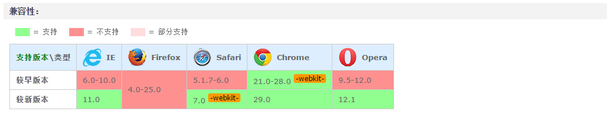

旧写法box-lines:single/multiple 默认single  兼容如下

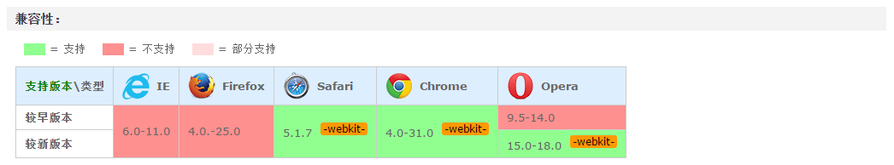

ie11下还是不支持此属性，上面firefox不支持但在25版本后是支持的，还是要用flex加-moz, 比较直观所以定义子元素换行时 可以如下写法

```
　　-webkit-flex-wrap:wrap;
    -webkit-box-lines:multiple;
    -moz-flex-wrap:wrap;
    flex-wrap:wrap;
```

 

**flex-flow**

这个是上面两个属性的合写

flex-flow兼容


为了兼容到旧的浏览器就需要用到box-orient+box-lines配合 故兼容可以如下写

```
    -webkit-flex-flow:row wrap;
    -webkit-box-orient:horizontal;
    -webkit-box-lines:multiple;　　-moz-flex-flow:row wrap;
    box-orient:horizontal;
    box-lines:multiple;
    flex-flow:row wrap;
```

**横向排列布局**

新版本justify-content的兼容情况

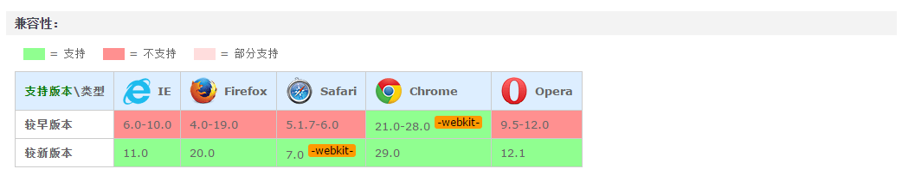

旧版本box-pack的兼容情况

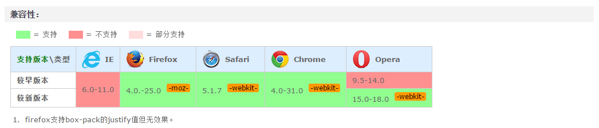

故兼容可写成：

```
-webkit-justify-content:center;
justify-content:center;
-moz-box-pack:center;
-webkit--moz-box-pack:center;
box-pack:center;
```

**竖向排列布局**

新版本align-items兼容情况

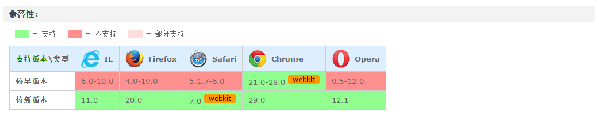

旧版本box-align的兼容情况

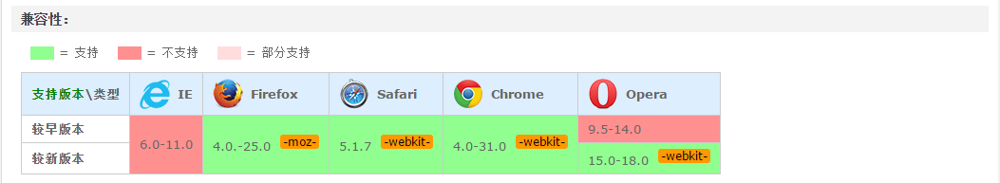

故兼容性可写成：

```
align-items:center;
-webkit-align-items:center;
box-align:center;
-moz-box-align:center;
-webkit-box-align:center;
```

**伸缩盒子布局兼容**

新版本flex:num兼容

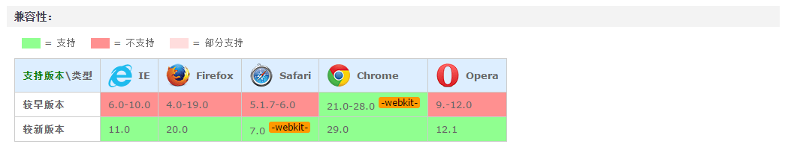

旧版本box-flex兼容

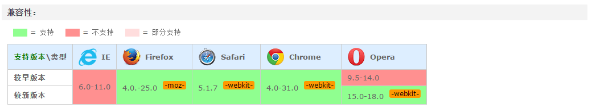

故兼容性可写成

```
box-flex:num;
-webkit-box-flex:num;
-moz-box-flex:num;
flex:num;
-webkit-flex:num;
```

 **元素出现顺序**

新版本order:num兼容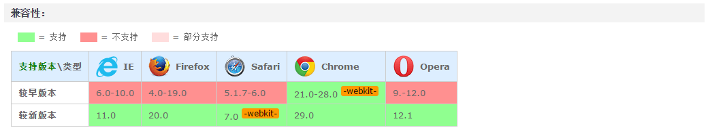

旧版本border-order:num兼容

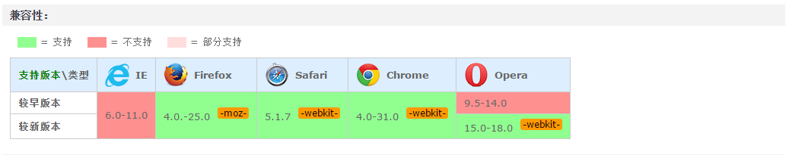

故兼容性可写成

```
box-order:num;
-webkit-box-order:num;
-moz-box-order:num;
order:num;
-webkit-order:num;
```

 