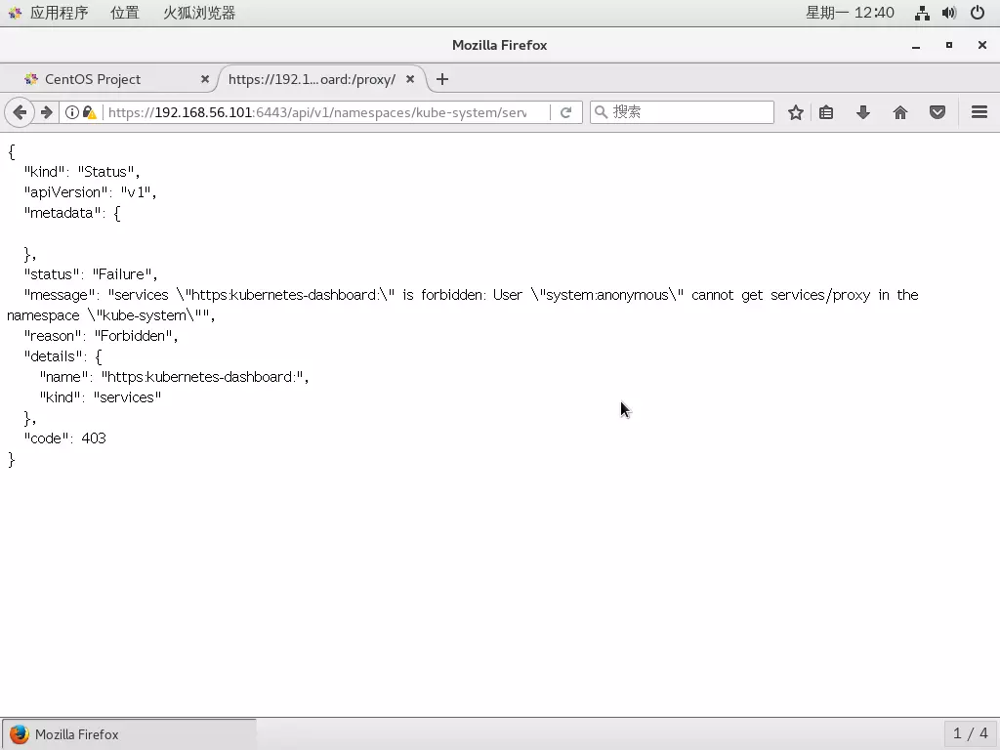

一、K8S Dashboard简介
简单的说，K8S Dashboard是官方的一个基于WEB的用户界面，专门用来管理K8S集群，并可展示集群的状态。K8S集群安装好后默认没有包含Dashboard，我们需要额外创建它。

Dashboard的搭建过程中，会遇到一些坑。现在开始，咱们一步一步踩来，走你!

二、RABC简介
还是那句话，官方文档是最重要的参考资料：https://kubernetes.io/docs/tasks/access-application-cluster/web-ui-dashboard/
该文档中，创建kubernetes-dashboard的命令为：
kubectl create -f https://raw.githubusercontent.com/kubernetes/dashboard/master/src/deploy/recommended/kubernetes-dashboard.yaml
当然，直接这样创建的dashboard会有很多问题，参见：

> Please note, this works only if the apiserver is set up to allow authentication with username and password. This is not currently the case with some setup tools (e.g., kubeadm). Refer to the authentication admin documentation for information on how to configure authentication manually.
> --------------------- 

因为我们使用kubeadm搭建的集群会默认开启RABC（角色访问控制机制），所以我们必须要进行额外的设置。关于RABC的概念，网上资料很多，大家务必提前了解。这里简要介绍一下几个重要概念：

RBAC
K8S 1.6引进，是让用户能够访问 k8S API 资源的授权方式【不授权就没有资格访问K8S的资源】
用户
K8S有两种用户：User和Service Account。其中，User给人用，Service Account给进程用，让进程有相关权限。如Dashboard就是一个进程，我们就可以创建一个Service Account给它
角色
Role是一系列权限的集合，例如一个Role可包含读取和列出 Pod的权限【 ClusterRole 和 Role 类似，其权限范围是整个集群】
角色绑定
RoleBinding把角色映射到用户，从而让这些用户拥有该角色的权限【ClusterRoleBinding 和RoleBinding 类似，可让用户拥有 ClusterRole 的权限】
Secret
Secret是一个包含少量敏感信息如密码，令牌，或秘钥的对象。把这些信息保存在 Secret对象中，可以在这些信息被使用时加以控制，并可以降低信息泄露的风险
如下图，灰色是“角色”，蓝色是“用户”，绿色是“角色绑定”，黄色是该角色拥有的权限。简言之 ，角色绑定将角色和用户进行挂钩：


三、官方kubernetes-dashboard.yaml简介
很有必要介绍一下官方的kubernetes-dashboard.yaml，我们首先将其下载下来：
wget https://raw.githubusercontent.com/kubernetes/dashboard/master/src/deploy/recommended/kubernetes-dashboard.yaml

该文件分为以下几部分：

Dashboard Service
Dashboard Deployment
Dashboard Role
RoleBinding
Dashboard Service Account
Dashboard Secret
这里，我们简单的对各个部分的功能进行介绍：

#### Dashboard Role

```yaml
kind: Role
apiVersion: rbac.authorization.k8s.io/v1
metadata:
  name: kubernetes-dashboard-minimal
  namespace: kube-system
rules:
  # Allow Dashboard to create 'kubernetes-dashboard-key-holder' secret.
- apiGroups: [""]
  resources: ["secrets"]
  verbs: ["create"]
  # Allow Dashboard to create 'kubernetes-dashboard-settings' config map.
- apiGroups: [""]
  resources: ["configmaps"]
  verbs: ["create"]
  # Allow Dashboard to get, update and delete Dashboard exclusive secrets.
- apiGroups: [""]
  resources: ["secrets"]
  resourceNames: ["kubernetes-dashboard-key-holder", "kubernetes-dashboard-certs"]
  verbs: ["get", "update", "delete"]
  # Allow Dashboard to get and update 'kubernetes-dashboard-settings' config map.
- apiGroups: [""]
  resources: ["configmaps"]
  resourceNames: ["kubernetes-dashboard-settings"]
  verbs: ["get", "update"]
  # Allow Dashboard to get metrics from heapster.
- apiGroups: [""]
  resources: ["services"]
  resourceNames: ["heapster"]
  verbs: ["proxy"]
- apiGroups: [""]
  resources: ["services/proxy"]
  resourceNames: ["heapster", "http:heapster:", "https:heapster:"]
  verbs: ["get"]
```

如上定义了Dashboard 的角色，其角色名称为kubernetes-dashboard-minimal，rules中清晰的列出了其拥有的多个权限。通过名称我们可以猜到，这个权限级别是比较低的。

```yaml
kind: ServiceAccount
metadata:
  labels:
    k8s-app: kubernetes-dashboard
  name: kubernetes-dashboard
  namespace: kube-system
```

如上定义了Dashboard的用户，其类型为ServiceAccount，名称为kubernetes-dashboard。

#### RoleBinding

```yaml
kind: RoleBinding
metadata:
  name: kubernetes-dashboard-minimal
  namespace: kube-system
roleRef:
  apiGroup: rbac.authorization.k8s.io
  kind: Role
  name: kubernetes-dashboard-minimal
subjects:
- kind: ServiceAccount
  name: kubernetes-dashboard
  namespace: kube-system
```

如上定义了Dashboard的角色绑定，其名称为kubernetes-dashboard-minimal，roleRef中为被绑定的角色，也叫kubernetes-dashboard-minimal，subjects中为绑定的用户：kubernetes-dashboard。

#### Dashboard Secret

```yaml
kind: Secret
metadata:
  labels:
    k8s-app: kubernetes-dashboard
  name: kubernetes-dashboard-certs
  namespace: kube-system
type: Opaque
```

#### Dashboard Deployment

```yaml
kind: Deployment
apiVersion: apps/v1beta2
metadata:
  labels:
    k8s-app: kubernetes-dashboard
  name: kubernetes-dashboard
  namespace: kube-system
spec:
  replicas: 1
  revisionHistoryLimit: 10
  selector:
    matchLabels:
      k8s-app: kubernetes-dashboard
  template:
    metadata:
      labels:
        k8s-app: kubernetes-dashboard
    spec:
      containers:
      - name: kubernetes-dashboard
        image: k8s.gcr.io/kubernetes-dashboard-amd64:v1.8.3
        ports:
        - containerPort: 8443
          protocol: TCP
        args:
          - --auto-generate-certificates
          # Uncomment the following line to manually specify Kubernetes API server Host
          # If not specified, Dashboard will attempt to auto discover the API server and connect
          # to it. Uncomment only if the default does not work.
          # - --apiserver-host=http://my-address:port
        volumeMounts:
        - name: kubernetes-dashboard-certs
          mountPath: /certs
          # Create on-disk volume to store exec logs
        - mountPath: /tmp
          name: tmp-volume
        livenessProbe:
          httpGet:
            scheme: HTTPS
            path: /
            port: 8443
          initialDelaySeconds: 30
          timeoutSeconds: 30
      volumes:
      - name: kubernetes-dashboard-certs
        secret:
          secretName: kubernetes-dashboard-certs
      - name: tmp-volume
        emptyDir: {}
      serviceAccountName: kubernetes-dashboard
      # Comment the following tolerations if Dashboard must not be deployed on master
      tolerations:
      - key: node-role.kubernetes.io/master
        effect: NoSchedule
```

如上可以看到，Dashboard的Deployment指定了其使用的ServiceAccount是kubernetes-dashboard。并且还将Secret kubernetes-dashboard-certs通过volumes挂在到pod内部的/certs路径。为何要挂载Secret ？原因是创建Secret 时会自动生成token。请注意参数--auto-generate-certificates，其表示Dashboard会自动生成证书。

### 四、安装Dashboard

#### 1.导入镜像

如果直接使用官方的kubernetes-dashboard.yaml创建Dashboard，你会踩到很多坑，首先是镜像拉取会超时失败。截止目前，Dashboard的最新版本是1.8.3，我已经将镜像k8s.gcr.io#kubernetes-dashboard-amd64.tar导出，提供给大家：
链接：https://pan.baidu.com/s/11AheivJxFzc4X6Q5_qCw8A 密码：2zov

在所有节点上（因为你不知道K8S会将Dashboard的pod调度到哪个节点），使用如下命令导入镜像：
docker load < k8s.gcr.io#kubernetes-dashboard-amd64.tar
#### 导入成功后，执行docker images可以看到Dashboard的版本是1.8.3：


#### 2.创建Dashboard

导入镜像后，使用之前下载的yaml文件即可创建Dashboard：
kubectl create -f kubernetes-dashboard.yaml

#### 3.访问Dashboard

根据官方文档，目前访问Dashboard有四种方式：

NodePort
API Server
kubectl proxy
Ingress
以上四种方式，我测试了前三种，目前只有NodePort和kubectl proxy可用，API Server暂时没有解决。

#### 使用NodePort

#### 为kubernetes-dashboard.yaml添加Service后，就可以使用NodePort访问Dashboard。在我们的物理机上，使用Chrome访问https://192.168.56.101:32159/，结果如下图所示：


如上可以看到，这里提示了证书错误NET::ERR_CERT_INVALID，原因是由于物理机的浏览器证书不可用。但是，不要放弃，我们这里不打算使用物理机访问浏览器，而使用Dashboard所在节点上的浏览器来访问（即CentOS自带的浏览器），这样的证书应该是可行的（官方默认就是这种方式）。

由于之前建立虚拟机环境时，我们关闭了CentOS的图形界面，这里我们为了访问Dashboard临时开启，执行：systemctl set-default graphical.target。重启后，即可进入图形界面。我们用Firefox访问：https://192.168.56.101:32159/，成功后出现如下界面：


需要注意的是，若提示“连接不安全”的警告时，点击“高级”，点击“添加例外”后即可：


#### 使用API Server

在我们的物理机上，使用Chrome访问地址：https://192.168.56.101:6443/api/v1/namespaces/kube-system/services/https:kubernetes-dashboard:/proxy/，返回如下错误：

#### {
  "kind": "Status",
  "apiVersion": "v1",
  "metadata": {
    
  },
  "status": "Failure",
  "message": "services "https:kubernetes-dashboard:" is forbidden: User "system:anonymous" cannot get services/proxy in the namespace "kube-system"",
  "reason": "Forbidden",
  "details": {
    "name": "https:kubernetes-dashboard:",
    "kind": "services"
  },
  "code": 403
}

原因是由于kube-apiserver使用了TLS认证，而我们的真实物理机上的浏览器使用匿名证书（因为没有可用的证书）去访问Dashboard，导致授权失败而不无法访问。官方提供的解决方法是将kubelet的证书转化为浏览器可用的证书，然后导入进浏览器。

Note: This way of accessing Dashboard is only possible if you choose to install your user certificates in the browser. In example certificates used by kubeconfig file to contact API Server can be used.

但是该方法目前似乎不适用于kubeadm方式安装的集群，参见：https://github.com/opsnull/follow-me-install-kubernetes-cluster/issues/5

#### 那如果使用节点自带的Firefox呢？我们在Firefox中访问：https://192.168.56.101:6443/api/v1/namespaces/kube-system/services/https:kubernetes-dashboard:/proxy/，仍然提示上面的错误：


看来，无论物理机还是K8S节点上的浏览器，都需要导入这个证书，暂时无解。

#### 使用kubectl proxy

这里，我主要介绍一下最便捷的kubectl proxy方式。在Master上执行kubecll proxy，然后使用如下地址访问Dashboard：
http://localhost:8001/api/v1/namespaces/kube-system/services/https:kubernetes-dashboard:/proxy
但限制就是必须在Master上访问，这显然是个坑，我们的目标是在我们真实的物理机上去访问Master的Dashboard。

所以，在主节点上，我们执行kubectl proxy --address=192.168.56.101 --disable-filter=true开启代理。
其中：

address表示外界可以使用192.168.56.101来访问Dashboard，我们也可以使用0.0.0.0
disable-filter=true表示禁用请求过滤功能，否则我们的请求会被拒绝，并提示 Forbidden (403) Unauthorized。
我们也可以指定端口，具体请查看kubectl proxy --help
如下图所示，proxy默认对Master的8001端口进行监听：


这样，我们就可以使用如下地址访问登录界面：
`http://192.168.56.101:8001/api/v1/namespaces/kube-system/services/https:kubernetes-dashboard:/proxy/#!/login`


#### 4.配置Dashboard

Dashboard的配置是难点，尤其是涉及到安全权限相关，相当复杂，坑也比较多。

进入Dashboard的登录界面后，认证方式有Kubeconfig和令牌两种方式（实际上还有账号密码的方式，默认不开启不显示）。看到Kubeconfig和令牌，估计头都大了。是否有简便的方法，让我们能直接访问Dashboard？当然有，选择跳过，会出现如下页面：
--------------------- 


如上图，很遗憾，我们看到了很多权限错误提示，主要是system:serviceaccount:kube-system:kubernetes-dashboard的权限不足引起的。

我们回想本文第三小节对kubernetes-dashboard.yaml的介绍，现在就理解了为什么其角色的名称为kubernetes-dashboard-minimal。一句话，这个Role的权限不够！

因此，我们可以更改RoleBinding修改为ClusterRoleBinding，并且修改roleRef中的kind和name，使用cluster-admin这个非常牛逼的CusterRole（超级用户权限，其拥有访问kube-apiserver的所有权限）。如下：

```yaml
apiVersion: rbac.authorization.k8s.io/v1
kind: ClusterRoleBinding
metadata:
  name: kubernetes-dashboard-minimal
  namespace: kube-system
roleRef:
  apiGroup: rbac.authorization.k8s.io
  kind: ClusterRole
  name: cluster-admin
subjects:
- kind: ServiceAccount
  name: kubernetes-dashboard
```

修改后，重新创建kubernetes-dashboard.yaml，Dashboard就可以拥有访问整个K8S 集群API的权限。我们重新访问Dashboard，如下图所示：


如上，一切正常，请在界面上尽情的乱点吧。另外，如果有兴趣，你还可以安装Dashboard的Heapster插件，这里就不再介绍了。